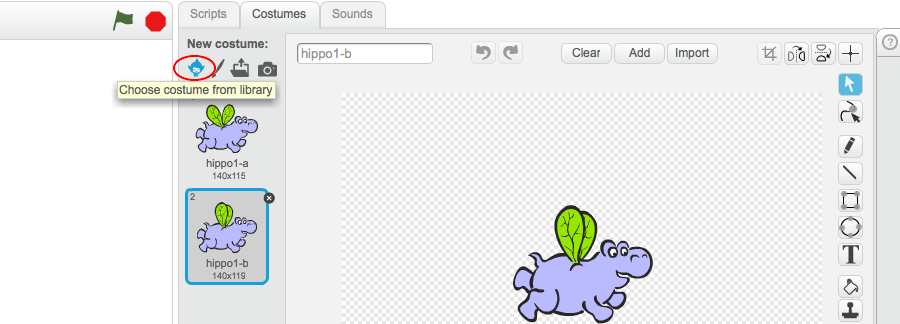
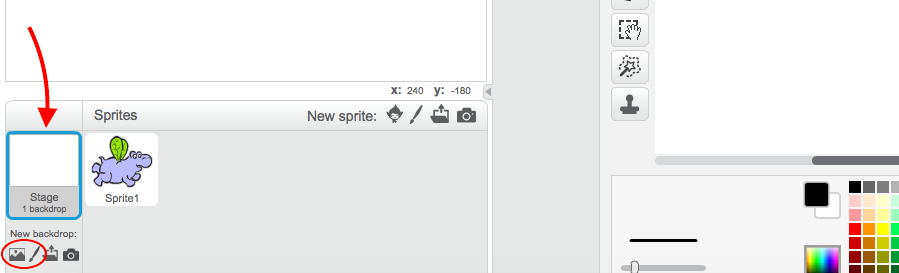

1. In this project you're going to make some animated flying hippos! Open Scratch and create a new project.

2. Let's change that cat into something with wings. Click on the cat and go to the **Costumes** tab. Click the first icon under **New costume** to choose a costume from the library.   

3. Find the _flying hippo_. There are two: select one of them and click **OK**. Then add another costume the same way, and select the other flying hippo. Delete the two cat costumes by clicking on the little **x**. 

4. Now let's make the hippo fly! In the Sprites panel, click your sprite. Add the following script to your sprite: 

5. Click on the green flag and watch the wings flap!

6. Next add the following blocks: 

7. Click on the green flag now. That’s the animation complete! 

8. You’re just missing a background. In the bottom left corner, you'll see the Stage. click the first icon under New Backdrop to choose one from the library. If you prefer, you can make your own background. To do this, click on the **paintbrush** icon instead. 
    * To delete a backdrop, click on the **scissors** icon at the top of the screen and click the backdrop you want to delete.

9. Let's make more things fly! Click on the **duplicate** icon next to the scissors and click your sprite. Now there are two of them! Duplicate it as many times as you like. You can use the **scissors** button to delete sprites. 

10. Once you've duplicated the hippo, you can change the costumes on the new sprites if you want. Remember to choose two costumes that are nearly the same for the animation to work!

11. Why not try drawing your own costumes?  How about a bee instead of a hippo? Click the **paintbrush** under New Costume and draw your character. Then click the **duplicate** button \(remember, it's next to the **scissors**\) and click the costume you just made. In the second costume, change the wings so they are in a different position. 

Why not turn your animation into a game? Visit <b>http://dojo.soy/mini-scratch-begin</b> to find out how in the Beginner Scratch Sushi Cards, and earn  yourself a digital badge too! To see this card online or print out more, go to <b>http://dojo.soy/mini-sushi-scratch</b> 
