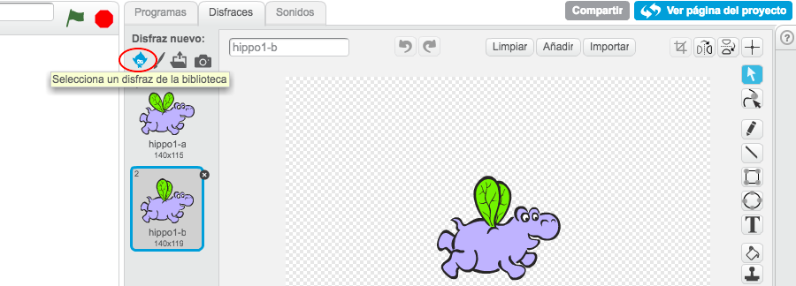
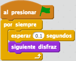
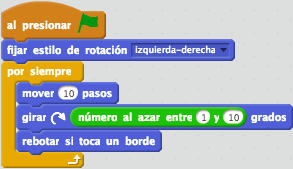
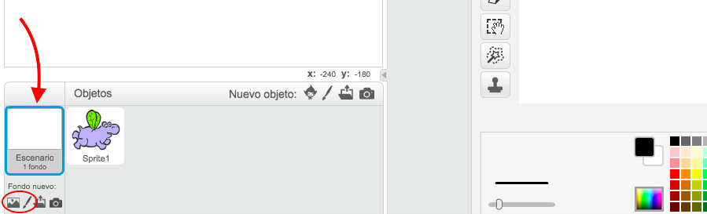
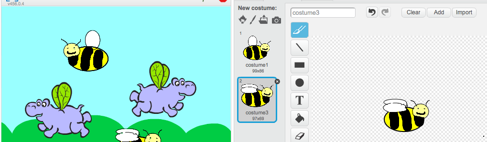

1. En este proyecto, ¡vas a crear hipopótamos animados voladores! Abre Scratch y crea un nuevo proyecto.

2. Transformemos el gato en algo con alas. Haz clic en el gato y ve a la ficha **Costumes**. Haz clic en el primer icono de **New costume** para seleccionar un traje en la biblioteca.   

3. Localiza _flying hippo_. Hay dos: selecciona uno y haz clic en **OK**. A continuación, añade otro traje del mismo modo y selecciona el otro hipopótamo volador. Borra los dos trajes de gato haciendo clic en la pequeña **x**. 

4. Ahora, ¡hagamos que el hipopótamo vuele! En el panel Sprites, haz clic en un sprite. Añade el siguiente texto a tu sprite. 

5. Haz clic en el indicador verde, ¡y observa las alas aletear!

6. A continuación, añade los siguientes bloques. 

7. Haz clic en el indicador verde. ¡Has completado la animación! 

8. Solamente falta un fondo. En la esquina inferior izquierda verás Stage. Haz clic en el primer icono de New Backdrop para seleccionar uno en la biblioteca. Si lo prefieres, puedes crear tu propio fondo. Para ello, haz clic en el icono **pincel**. 
    * Para borrar un fondo, haz clic en el icono **tijeras** en la parte superior de la pantalla y haz clic en el fondo que quieras borrar.

9. ¡Hagamos volar más cosas! Haz clic en el icono **duplicar** al lado de las tijeras y haz clic en tu sprite. ¡Ahora hay dos! Duplica tantas veces como quieras. Podrás usar el botón **tijeras** para borrar sprites. 

10. Cuando hayas duplicado el hipopótamo, podrás cambiar los trajes en los nuevos sprites si lo deseas. Recuerda, ¡selecciona dos trajes que sean casi idénticos para que la animación funcione!

11. ¿Por qué no pruebas a diseñar tus propios trajes?  ¿Qué te parece una abeja en lugar de un hipopótamo? Haz clic en el **pincel** en New Costume y dibuja tu personaje. A continuación, haz clic en el botón **duplicar** \(recuerda, está al lado de las **tijeras**\) y haz clic en el traje que acabas de crear.   En el segundo traje, cambia las alas de tal modo que estén en otra posición. 

¿Por qué no transformas tu animación en un juego? Visita <b>http://dojo.soy/mini-scratch-begin</b> para averiguar cómo en Beginner Scratch Sushi Cards, ¡y gana una insignia digital! Para ver esta tarjeta online o para imprimir más, visita <b>http://dojo.soy/mini-sushi-scratch</b> 
