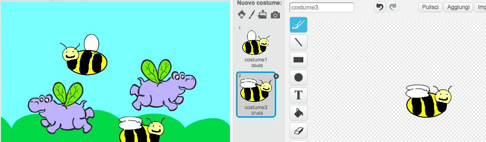

1. In questo progetto, realizzerai degli ippopotami volanti animati! Apri Scratch e crea un nuovo progetto.

2. Modifichiamo quel gatto in qualcosa con le ali. Fai clic sul gatto e vai alla scheda **Costumi**. Fai clic sulla prima icona sotto a **Nuovo costume** per scegliere un costume dalla raccolta.   

3. Trova l’_ippopotamo volante_. Ce ne sono due: selezionane uno e fai clic su **OK**. Aggiungi quindi un altro costume seguendo la stessa procedura e seleziona l’altro ippopotamo volante. Elimina i due costumi dei gatti facendo clic sulla piccola **x**. 

4. Ora facciamo volare gli ippopotami! Nel pannello Sprites, fai clic sul tuo sprite. Aggiungi la seguente sintassi al tuo sprite: 

5. Fai clic sulla bandierina verde e guarda lo sbattere delle ali!

6. Aggiungi quindi i seguenti blocchi: 

7. Fai clic ora sulla bandierina verde. L’animazione è completa! 

8. Ti manca solo lo sfondo. Nell’angolo in basso a sinistra, vedrai lo Stage. Fai clic sulla prima icona sotto **Nuovo sfondo** per sceglierne uno dalla raccolta. Se preferisci, puoi realizzarne uno tuo. In tal caso, dovrai fare clic sull’icona **Disegna un nuovo sfondo**. 
    * Per rimuovere uno sfondo, fai clic sull’icona **forbici** situata nella parte superiore della schermata e quindi sullo sfondo che desideri eliminare.

9. Facciamo volare altri elementi! Fai clic sull’icona **duplica** situata di fianco alle forbici e quindi sullo sprite. Adesso ne hai due! Duplicali quante volte vuoi. Puoi utilizzare le **forbici** per rimuovere gli sprite. 

10. Se lo desideri, una volta duplicato l’ippopotamo, puoi modificare i costumi dei nuovi sprite. Ricorda di scegliere due costumi simili per far funzionare l’animazione!

11. Perché non provi a disegnare tu i costumi?  Magari un’ape invece di un ippopotamo? Fai clic su **Disegna un nuovo costume** sotto a **Nuovo costume** e disegna il tuo personaggio. Fai clic sul pulsante **duplica** \(ricorda: si trova di fianco a **forbici**\) e fai clic sul costume che hai appena realizzato. Nel secondo costume, modifica le ali in modo che siano in una posizione diversa. 

Perché non trasformiamo l’animazione in un gioco? Visita <b>http://dojo.soy/mini-scratch-begin</b> per scoprire come con le Sushi Card per principianti  di Scratch e aggiudicati anche un adesivo digitale! Per visualizzare questa scheda online o per stamparne altre, visita <b>http://dojo.soy/mini-sushi-scratch</b> 
